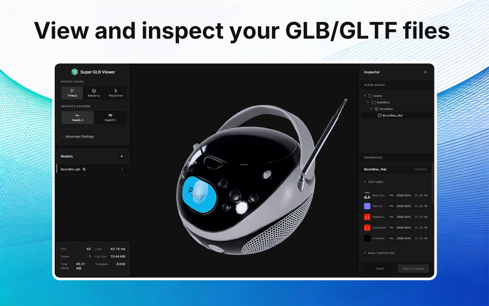
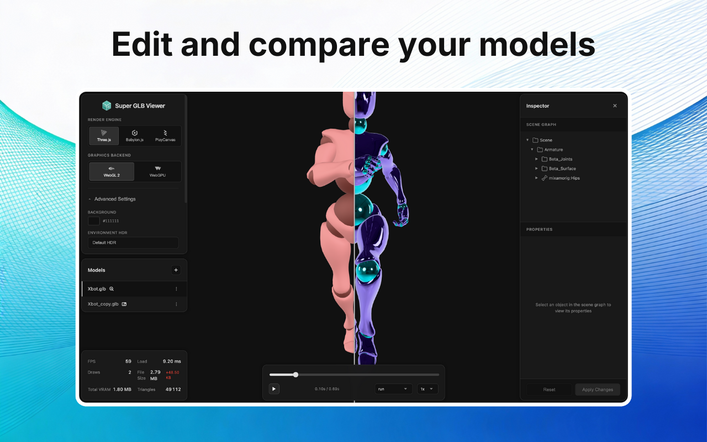
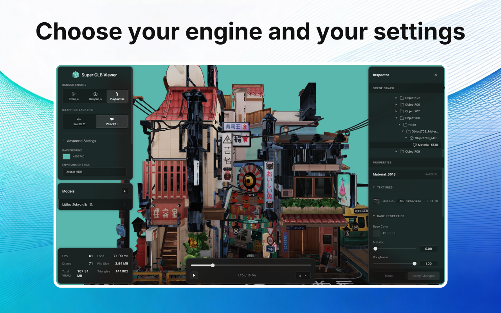

# Super GLB Viewer for VS Code

**Super GLB Viewer** is a VS Code extension for opening, inspecting, editing, and re-exporting `.glb` 3D models, with four interchangeable rendering engines: Unity, Three.js, Babylon.js, and PlayCanvas.

> **Prefer the browser?** The same engine runs as a free web app, no install needed: **[Super GLB Viewer (web)](https://jessyleite.dev/super-glb-viewer/)**

  
  
  

## Features

- Custom editor for `.glb` files
- Four engines: Unity, Three.js, Babylon.js, PlayCanvas
- WebGL2 and WebGPU backends
- Animation playback with seek, track selection, and speed control
- Blend shapes / morph targets with per-target weights
- Inspector for the scene graph, materials (PBR, clearcoat, transmission, sheen, volume), transforms, and lights
- Side-by-side model comparison with synchronized camera and stat deltas
- Mesh compression and KTX2 texture compression
- Export edited models back to `.glb`
- Shareable links (uploads the model to generate the URL)
- Custom HDR environments with exposure and tonemapping
- Stats panel: vertices, triangles, meshes, materials, textures, VRAM
- All processing is local. The Share feature is the only path that sends data off-machine.

## Supported Formats

| Format | Extension | Notes |
|--------|-----------|-------|
| GLB | `.glb` | Binary glTF, single file |

## Usage

1. Install the extension
2. Open a `.glb` file
3. The viewer opens automatically

### Camera Controls

| Action | Mouse | Keyboard |
|--------|-------|----------|
| Orbit | Left drag | Arrow keys / WASD |
| Pan | Right drag | (none) |
| Zoom | Scroll wheel | `+` / `-` |

### Switching Engines

Use the engine selector in the toolbar to swap between Unity, Three.js, Babylon.js, and PlayCanvas. Camera position, environment, and settings carry over.

## Requirements

- VS Code 1.80.0 or later

## Support & Community

Questions, bugs, or feature requests? The **[Discord](https://discord.com/invite/YCysRXST)** is the fastest way to reach me.

## License

MIT. See [LICENSE](LICENSE).

The embedded viewer library ([super-glb-viewer](https://github.com/jessyleite/super-glb-viewer)) ships under its own license. See `media/LICENSE`.

---

## More 3D Tools

Other tools I build for 3D and glTF workflows:

- **[Texture Master](https://jessyleite.dev/posts/texture-master/)**: all-in-one texture toolkit for Blender
- **[Autoskin](https://jessyleite.dev/posts/new-automatic-skinning-method-blender/)**: innovative voxel heat-diffusion automatic skinning for Blender

Built by **[Jessy Leite](https://jessyleite.dev)** · [@jessylte](https://x.com/jessylte)
